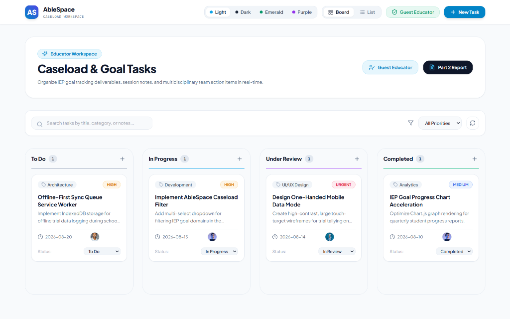
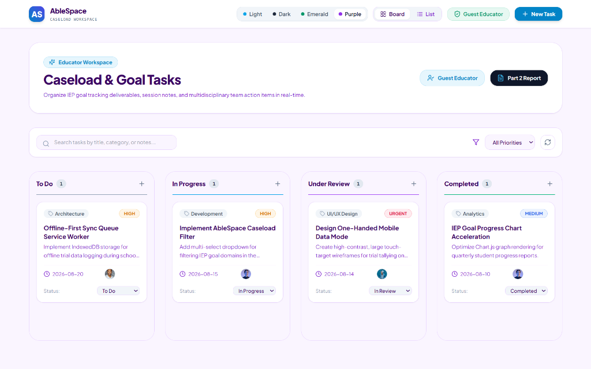
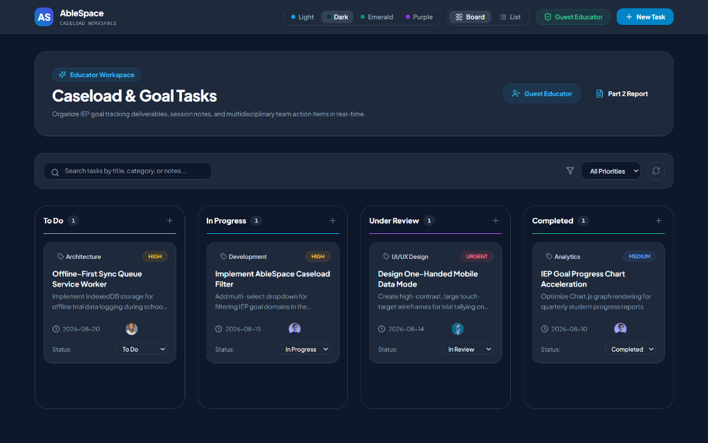
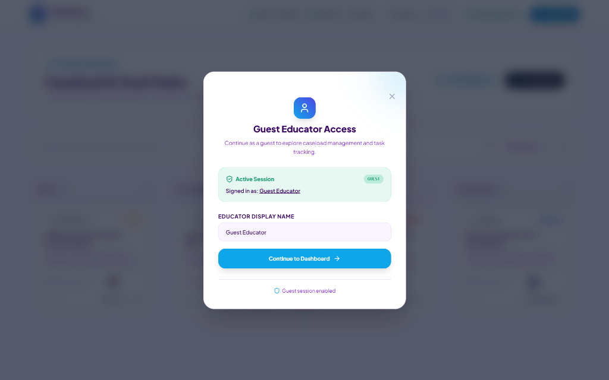
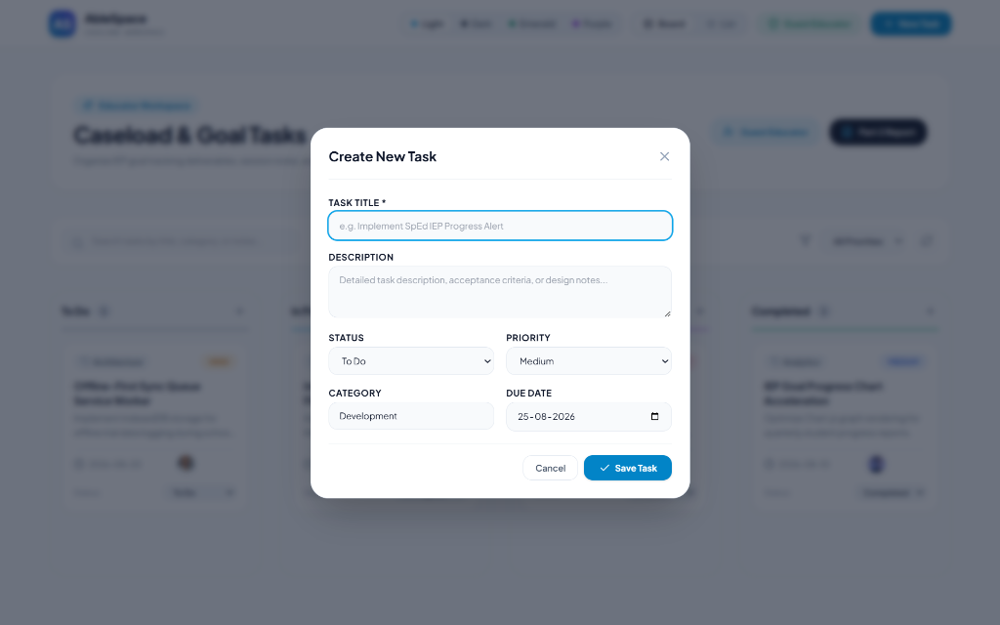
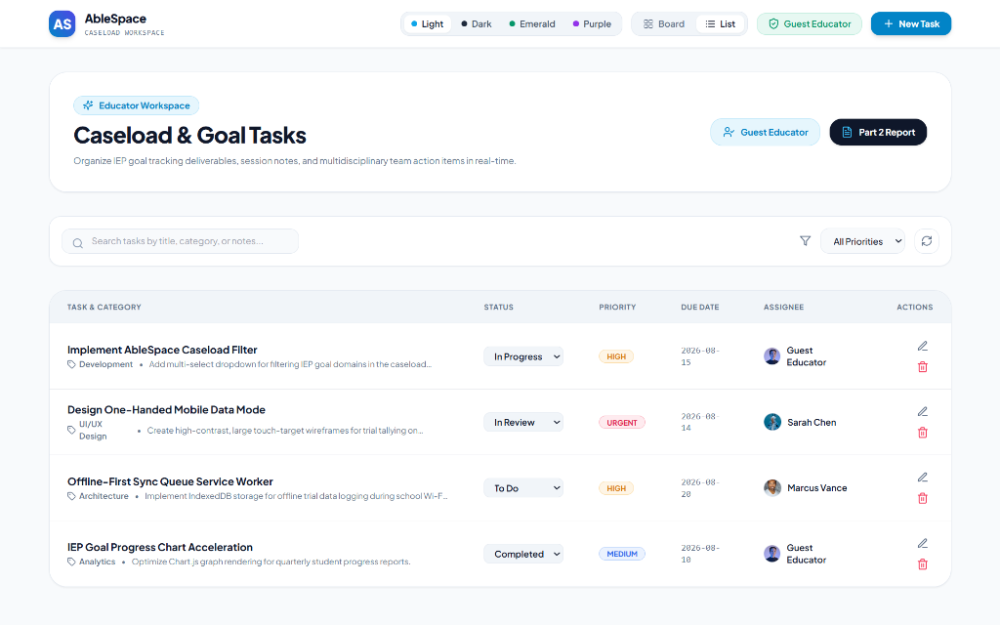
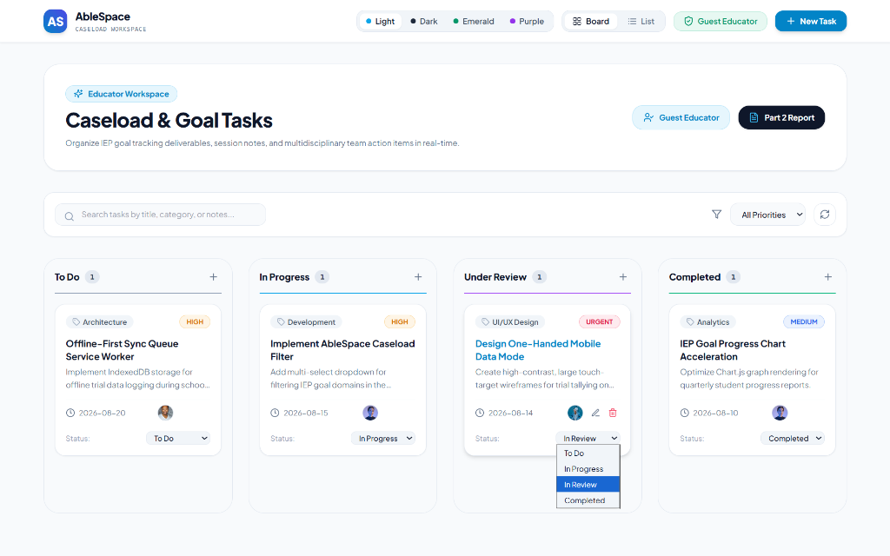

# AbleSpace Application Walkthrough & User Interface Report

**Candidate**: Aditya Kumar  
**Role**: Full Stack Developer (Fresher)  
**Live Application URL**: [https://ablespaceassisment.netlify.app/](https://ablespaceassisment.netlify.app/)  
**GitHub Repository**: [https://github.com/Adityakumar926/ablespace-assessment](https://github.com/Adityakumar926/ablespace-assessment)  

---

## 1. Executive Summary

This walkthrough document provides a complete visual and functional tour of the **AbleSpace Task & Caseload Management Application**. Engineered to serve Special Education (SpEd) teachers, Speech-Language Pathologists (SLPs), OTs, and BCBAs, the platform simplifies IEP goal tracking, multidisciplinary team collaboration, and daily instructional task management.

The application is deployed live at **[ablespaceassisment.netlify.app](https://ablespaceassisment.netlify.app/)**. Below is a detailed walkthrough of all primary workflows, design systems, theme engine capabilities, guest authentication, and user interactions with screenshots from the live application.

---

## 2. Walkthrough & Visual Interface Tour

### 📸 Figure 1: Main Educator Workspace & Kanban Board (Light Theme)

#### Core Interface Elements:
1. **Header Navigation Bar**:
   - **Branding**: `AS` logo badge and `AbleSpace Caseload Workspace` title.
   - **Theme Selector**: Instant toggle between 4 custom color palettes (**Light**, **Dark**, **Emerald**, **Purple**).
   - **View Mode Switcher**: Seamless toggle between **Board** (Kanban) and **List** (Table) layouts.
   - **Guest Access**: Badge showing active user session (*Guest Educator*).
   - **Primary Action**: High-visibility `+ New Task` button.

2. **Dashboard Hero Banner**:
   - High-contrast card displaying workspace context: *"Organize IEP goal tracking deliverables, session notes, and multidisciplinary team action items in real-time."*
   - Direct shortcut buttons to access the **Guest Educator Portal** and the **Part 2 Product Report**.

3. **Search & Priority Filter Bar**:
   - **Real-Time Text Search**: Instant search filtering by task title, category, or description.
   - **Priority Filter**: Multi-level filter (`All Priorities`, `Low`, `Medium`, `High`, `Urgent`).
   - **Data Refresh**: Quick refresh button to sync task data.

4. **Kanban Status Columns**:
   - Organized into 4 workflow stages: **To Do**, **In Progress**, **Under Review**, and **Completed**.
   - Each column features task counter pills, category tags (*Architecture*, *Development*, *UI/UX Design*, *Analytics*), priority pills, due dates, assignee avatars, and inline status selectors.

---

### 📸 Figure 2: Purple Theme Mode Layout

#### Visual Palette Highlights:
- **Soft Violet Accent Background**: Custom CSS variables mapping `--bg-primary: #faf5ff` and `--border-color: #e9d5ff`.
- **Theme Engine Architecture**: Seamless theme changes across the DOM without layout shift. Theme selection persists in `localStorage` across browser reloads.

---

### 📸 Figure 3: High-Contrast Dark Theme Mode Layout

#### High-Contrast Styling:
- **Reduced Eye Strain Environment**: Built with `#0f172a` Slate-900 background, `#1e293b` card container background, and high-contrast typography (`#f8fafc`).
- Designed for low-light classroom and office settings.

---

### 📸 Figure 4: Guest Educator Access Portal Modal

#### Guest Authentication Flow:
- **Instant Evaluator Access**: Clicking **`Guest Access`** in the header or **`Guest Educator`** in the hero banner opens the access modal.
- **Custom Display Name**: Allows evaluators to type a custom name (e.g. *"Guest Educator"*, *"Aditya Kumar"*, *"Assessor"*).
- **Backend Session Sync**: Issues a guest session token (`guest_token_...`) via NestJS backend (`POST /api/auth/guest`).
- **Assigned Tasks Integration**: Tasks created by the active guest user automatically assign to their display name.

---

### 📸 Figure 5: Task Creation & Editing Modal

#### Dialog Form Features:
- **Backdrop Blur Modal**: Centered modal with active focus outlines (`e.g. Implement SpEd IEP Progress Alert`).
- **Input Fields**: Task Title *(Required)*, Multiline Description, Status Dropdown, Priority Dropdown, Category Tag, and Date Picker.
- **Form Actions**: `Cancel` (ghost button) and primary `✓ Save Task` button.

---

### 📸 Figure 6: Table List View Layout

#### High-Density Tabular Roster:
- Alternative view for educators managing extensive caseload task lists.
- Display columns: **Task & Category**, **Status Dropdown**, **Priority Badge**, **Due Date**, **Assignee**, and **Actions**.
- Hover action triggers for inline editing and task deletion.

---

### 📸 Figure 7: Card Interactivity & Quick Status Progression

#### Micro-Interactions:
- **Hover Reveal Controls**: Hovering over any task card reveals edit (pencil) and delete (trash) action buttons.
- **1-Click Status Dropdown**: Card footers include an inline dropdown to move tasks across workflow columns (*To Do* $\rightarrow$ *In Progress* $\rightarrow$ *Under Review* $\rightarrow$ *Completed*) in a single click.

---

## 3. Submission Links & Artifacts

| Artifact | Location |
| :--- | :--- |
| **Live Deployed Application** | [https://ablespaceassisment.netlify.app/](https://ablespaceassisment.netlify.app/) |
| **GitHub Repository** | [https://github.com/Adityakumar926/ablespace-assessment](https://github.com/Adityakumar926/ablespace-assessment) |
| **Part 2 Product Understanding Report** | [`part-2/part_2_product_understanding.md`](https://github.com/Adityakumar926/ablespace-assessment/blob/main/part-2/part_2_product_understanding.md) |
| **Part 2 Product Understanding PDF** | [`part-2/part_2_product_understanding.pdf`](https://github.com/Adityakumar926/ablespace-assessment/blob/main/part-2/part_2_product_understanding.pdf) |
| **Application Walkthrough Report** | [`part-2/AbleSpace_Application_Walkthrough.md`](https://github.com/Adityakumar926/ablespace-assessment/blob/main/part-2/AbleSpace_Application_Walkthrough.md) |
| **Monorepo README** | [`README.md`](https://github.com/Adityakumar926/ablespace-assessment/blob/main/README.md) |
