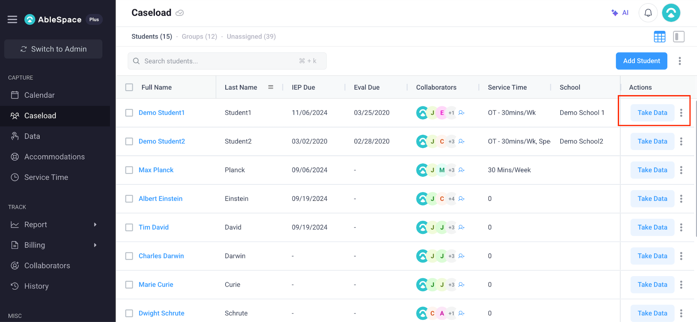

# Part 2: Product Understanding & UX Analysis Report

**Company**: AbleSpace  
**Role**: Full Stack Developer (Fresher)  
**Subject**: In-Depth Workflow Analysis of the AbleSpace "Take Data" Screen (Caseload Tab) & UX/UI Improvement Recommendations  

---

## 1. Executive Summary

AbleSpace is a specialized Special Education (SpEd) management platform engineered for Special Education Teachers, Speech-Language Pathologists (SLPs), Occupational Therapists (OTs), and Behavior Specialists (BCBAs). The platform streamlines IEP (Individualized Education Program) goal tracking, caseload management, data collection, and compliance reporting.

The **"Take Data"** button on the **Caseload** tab serves as the primary operational entry point for practitioners entering instructional or therapy sessions with students.



---

## 2. Interface & Workflow Breakdown

### 2.1 The Caseload Roster Interface
As shown in the screenshot above, the **Caseload** screen features:
- **Navigation Sidebar**: Quick access to *Calendar*, *Caseload* (Active), *Data*, *Accommodations*, *Service Time*, *Reports*, *Billing*, and *Collaborators*.
- **Roster Overview Header**: Quick metrics on `Students (15)`, `Groups (12)`, and `Unassigned (39)`.
- **Search & Filter Bar**: Instant search with keyboard shortcut (`⌘ + k`) and a primary action button `+ Add Student`.
- **Student Data Table**:
  - `Full Name` & `Last Name` (e.g. *Demo Student1*, *Demo Student2*, *Max Planck*, *Albert Einstein*)
  - `IEP Due` date tracking (e.g. *11/06/2024*)
  - `Eval Due` date compliance tracking
  - `Collaborators` avatars and multidisciplinary team indicators
  - `Service Time` allocations (e.g. *OT - 30mins/Wk*)
  - `Actions`: High-visibility **`Take Data`** primary button highlighted in red.

---

### 2.2 The "Take Data" Session Workflow

When a practitioner clicks **`Take Data`**, the application launches the real-time data collection modal/screen. The workflow operates as follows:

```
[ Caseload Tab Roster ] ──> Click [ Take Data ] ──> [ Session Active View ]
                                                             │
┌────────────────────────────────────────────────────────────┘
│
├──> 1. Goal Domain Selection (Academic, Speech/Language, Social, Motor, Behavioral)
├──> 2. Trial-Based Accuracy Tallying (+ / - buttons for DTT trials)
├──> 3. Prompt Level Hierarchy Logging (Independent ➔ Verbal ➔ Gestural ➔ Physical)
├──> 4. Duration & Latency Stopwatch Timers (Session time & initiation latency)
└──> 5. Qualitative Clinical Notes & Accommodation Tags
                                                             │
┌────────────────────────────────────────────────────────────┘
│
v
[ Click Save Session ] ──> [ Auto-Sync to IEP Progress Reports & Graphs ]
```

1. **Goal & Sub-Goal Targeting**: The practitioner selects the specific IEP goal to target during the session (e.g. *"Student will correctly pronounce /s/ blends with 80% accuracy across 3 consecutive sessions"*).
2. **Real-Time Data Collection**:
   - **Trial Counters**: Quick tap `+` (Correct) or `-` (Incorrect) to tally discrete trial responses.
   - **Prompt Hierarchy**: Logging the level of support needed (*Independent*, *Visual*, *Verbal*, *Gestural*, *Model*, *Partial Physical*, *Full Physical*).
   - **Frequency & Rate Counters**: Tallying occurrences of specific behaviors or positive reinforcement triggers.
   - **Duration Timers**: Integrated stopwatch to measure task engagement duration or prompt latency.
3. **Session Notes**: Recording environmental context, sensory accommodations used, and qualitative observations.
4. **Automated Graph & Progress Report Sync**: Submitted data points instantly update visual progress trend lines and quarterly IEP compliance reports without requiring manual spreadsheet data entry.

---

## 3. UX/UI & Functional Improvement Recommendations

While AbleSpace's "Take Data" workflow solves core SpEd tracking requirements, educators operate in chaotic, fast-moving classroom environments. Below are 5 prioritized improvements:

### 💡 Recommendation 1: One-Handed Mobile / Tablet Touch Mode
- **Current Limitation**: In mobile or tablet views, small icons and dense sub-menus require precise two-handed navigation.
- **Proposed Enhancement**: Introduce a "Quick Data Mode" layout with enlarged ($>60\text{px}$) high-contrast touch targets for thumb-based single-tap trial tallying.

### 💡 Recommendation 2: Group Session View (Simultaneous Multi-Student Logging)
- **Current Limitation**: Teachers conducting small-group instruction (3-4 students simultaneously) must constantly navigate back and forth between student profiles.
- **Proposed Enhancement**: Add a "Group Session Mode" displaying side-by-side mini data cards for up to 4 students on one screen, allowing simultaneous trial tallying.

### 💡 Recommendation 3: Voice-Assisted Hands-Free Data Entry
- **Current Limitation**: During physical therapy or sensory activities, practitioners cannot physically hold or tap a tablet screen.
- **Proposed Enhancement**: Integrate Web Speech API voice shortcuts (e.g. *"Log correct trial for Max"* or *"Add verbal prompt"*) for hands-free data entry.

### 💡 Recommendation 4: Offline-First Local Data Persistence
- **Current Limitation**: School Wi-Fi networks frequently drop connectivity, risking un-saved session data.
- **Proposed Enhancement**: Implement an offline queue using IndexedDB / LocalStorage with an automatic background sync manager that flushes pending session logs once internet connectivity is restored.

### 💡 Recommendation 5: Real-Time IEP Mastery Notifications
- **Current Limitation**: Teachers only discover that a student has achieved mastery after opening historical progress reports.
- **Proposed Enhancement**: Display real-time micro-banners during data collection (e.g. *"🎉 3 consecutive sessions at 80%+ accuracy – Mastery threshold met!"*), prompting teachers to review goal advancement immediately.

---

## 4. Feature Summary Matrix

| ID | Feature | Primary User Value | Complexity |
| :--- | :--- | :--- | :--- |
| **IMP-1** | One-Handed Quick Data Mode | Faster trial logging during active instruction | Low (CSS / UI Layout) |
| **IMP-2** | Multi-Student Group View | Eliminates context switching in group therapy | Medium (Grid & State Management) |
| **IMP-3** | Voice-Assisted Entry | Hands-free data logging during physical therapy | Medium (Web Speech API) |
| **IMP-4** | Offline-First Sync Queue | Prevents session data loss during Wi-Fi drops | Medium (IndexedDB / Service Worker) |
| **IMP-5** | Real-Time Mastery Banners | Immediate IEP milestone feedback | Low (Client-side threshold calculation) |
